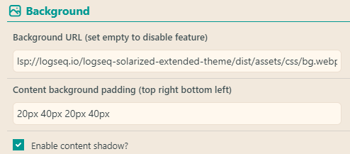
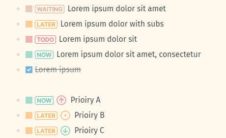
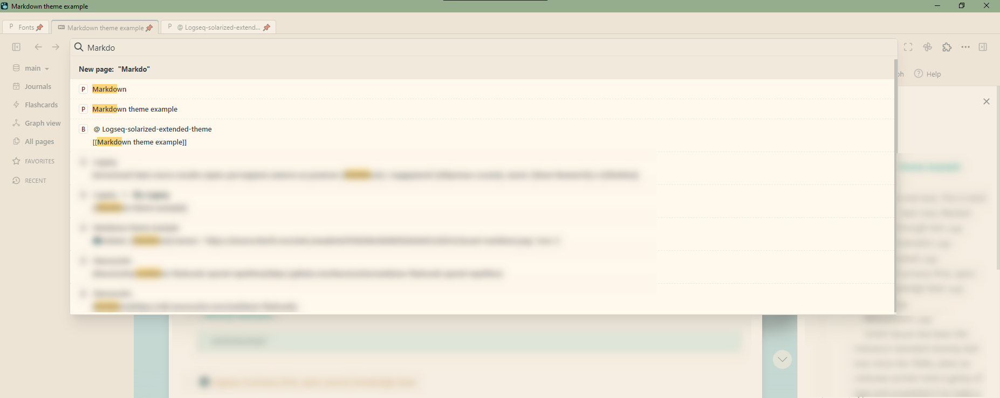
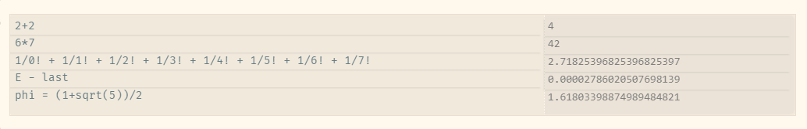

## ⚠ ATTENTION!⚠
### Favicons & internal links icons functionality moved to separate plugin ⭐ [Awesome Links](https://github.com/yoyurec/logseq-awesome-links)

### Sticky headers functionality moved to separate plugin 📌 [Sticky Headers](https://github.com/yoyurec/logseq-sticky-headers)

<h1 align="center">"Solarized Extended" theme for Logseq</h1>

    

> "Solarized" styling (aka theme) and "Extended" core (aka plugin) are separated - you can use ANY theme with reworked UI and features!
>
> (for Solarized colors and their settings - switch to the theme, for turn off features - disable the plugin).

* ⚡ Powered up with custom JS 👨‍💻
* 🔆 Light & dark versions
* Customizble settings: <a href="#settings">🡖</a>
    * 🎨 Customizable colors palette **text/backgrounds**: user defined (+ autogenerated shades) for UI and content elements
    * 🔮 Built-in theme **color presets**
    * 🈶 Different **fonts**: "Fira Sans" + AiWriter Quattro, Inter & OS System
    * 🖼 Background image
    * 📏 Theme options for sizes
    * Features on/off
        * ✅ Colored tasks statuses & priorities <a href="#-colored-tasks-statuses--priorities">🡖</a>
        * 🚥`#.kanban` & `#.grid` columns (no plugin needed) <a href="#-kanban-board">🡖</a>
* 📰 Banners plugin support and powered-up! <a href="#-banners-plugin">🡖</a>
* 💬 Custom styled `#quote` <a href="#-blockquotes">🡖</a>
* etc...

Reworked UI:
* 🐱‍👤 Changed default UI layout, sidebars
* ✨ Changed icons, new added
* 🔥 Redesigned head toolbar: navigation arrows on left side, hidden home...
* 🔍 Redesigned search <a href="#-search-panel">🡖</a>
* 🗂 **"Tabs"** plugin support, reposition & recolor - like in real browser <a href="#-tabs-plugin">🡖</a>
* ⚙ Simplified, less noise and compact Logseq plugins settings popup
* 📋 Compact QUERY results header: settings, table toggler <a href="#-compact-query-results-header">🡖</a>
* 📝 Redesigned admonition blocks <a href="#-redesigned-admonition-blocks">🡖</a>
* 🧮 Redesigned calculator via @Playerofgames <a href="#-redesigned-calculator">🡖</a>

## If you ❤ what i'm doing - you can support my work! ☕

## Screenshots

## Install theme
From Logseq store - `Plugins -> Marketplace -> Themes`.

Or manually:
* load zip from Releases https://github.com/yoyurec/logseq-solarized-extended-theme/releases/latest
* extract zip, plugin should be near others plugins (hope it is `%username%\.logseq\plugins`)
* plugin foder name should be exactly `logseq-solarized-extended-theme`, without version

## Updating theme
Due Logseq rules - only "plugins" can have Settings, so after installation SolExt defines itself as "plugin".
⚠ So for updating search Solarized extended in `Plugins -> Installed -> Plugins` panel!

## Recommended plugins
* ⭐ [Awesome Links](https://github.com/yoyurec/logseq-awesome-links)
* 📌 [Sticky Headers](https://github.com/yoyurec/logseq-sticky-headers)
* 📰 [Banners](https://github.com/yoyurec/logseq-banners-plugin)
* [Tabs](https://github.com/pengx17/logseq-plugin-tabs)
* [Bullet Threading](https://github.com/pengx17/logseq-plugin-bullet-threading)
* [TOC Generator](https://github.com/sethyuan/logseq-plugin-tocgen)
* [TODO Master](https://github.com/pengx17/logseq-plugin-todo-master)

## Settings

### 🎨 Colors palette:
Change main colors in Settings

https://user-images.githubusercontent.com/137919/187081296-1c9c3312-cd86-4fbb-b78c-9fccbb0f52a5.mp4

### 🔮 Presets:
* select preset to apply it with read-only mode
* or select "Custom" to enable manual editing
* or select preset, press "Clone", edit applied colors, cose you on Custom mode now

**Choose preset: built-in (uneditable ⚠) OR user "Custom" (editable)**

https://user-images.githubusercontent.com/137919/187081307-f4cd176f-c294-492e-9dc6-63d31b4cc50e.mp4

**Clone presets to edit it**

https://user-images.githubusercontent.com/137919/187081312-82125847-db92-4c64-b50c-51d2053baa5d.mp4

### 🈶 Fonts
Change font and text size

### 🖼 Background image:
* go to https://unsplash.com
* choose any image, click (go to its details page with bigger image)
* right click on image, "copy image link",
* edit URL in settings

### 📏 Sizes
Change sidebars and content width in Settings

## Features and customizations

### ✅ Colored tasks statuses & priorities

### 🚥 Kanban board
Just add `#.kanban` tag to parent block and all children will become columns!
Recommend additionally to install [Logseq Plugin TODO Master](https://github.com/pengx17/logseq-plugin-todo-master)
and check [Logseq template](./extra/Kanban%20template.md)

### 📰 Banners plugin
Theme supports [Banners plugin](https://github.com/yoyurec/logseq-banners-plugin)
Background = blurred banner!
Icon glows!

Demo video: https://www.loom.com/share/31416785f6764a7a80fba271aea4ea79

### 💬 Blockquotes
Just add `#quote` tag to parent block!

## Reworked UI

### 🔍 Search panel

Wide responsive search like in browser!

### 🗂 Tabs plugin

Theme supports [Tabs plugin](https://github.com/pengx17/logseq-plugin-tabs) - panel was moved to top & auto-recolored to current (ANY) theme

### 📝 Redesigned admonition blocks

### 📋 Compact QUERY results header

### 🧮 Redesigned calculator

## What is Logseq?
Logseq is a privacy-first, open-source knowledge base. Visit https://logseq.com for more information.

## Support
* Read about Logseq plugin updates on Dicscord - https://discord.com/channels/725182569297215569/896368413243494430
* Ask about Logseq plugins on Dicscord - https://discord.com/channels/725182569297215569/752845167030960141
* If you have any questions, issues or feature request, use the issue submission on GitHub: https://github.com/yoyurec/logseq-solarized-extended-theme/issues

## Credits
* Icon - Keiran O'Leary https://dribbble.com/shots/6361500-Alacritty-Terminal-Icon
* ["iA Writer" fonts](https://ia.net/topics/a-typographic-christmas): Copyright © 2018 Information Architects Inc. with Reserved Font Name "iA Writer". Licensed under the SIL Open Font License 1.1.
* Theme colors inspiration - Nicholas Martin https://github.com/nmartin84/logseq-solarized
* Kanban view inspiration - @Cannibalox https://github.com/cannibalox/logtools
* Calculator colors - @Playerofgames https://github.com/playerofgames/logseq-mia-theme

## License

[MIT License](./LICENSE)
