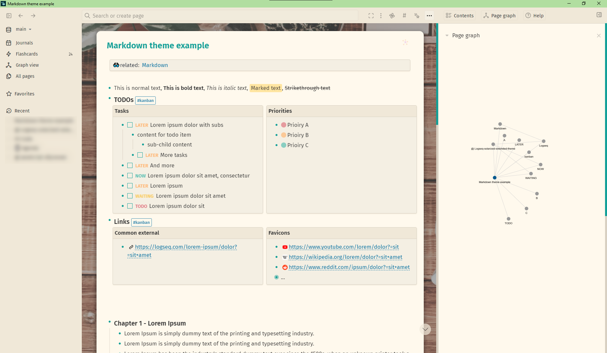
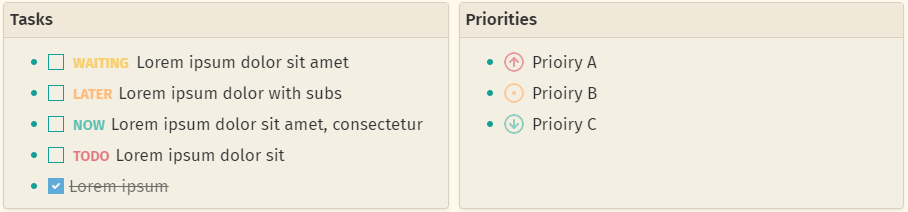

## Solarized extended theme for Logseq (light only!)
<table border="0">
 <tr>
    <td>
        <p align="center">
            <a href="https://github.com/yoyurec/logseq-solarized-extended-theme">
                
            </a>
        </p>
    </td>
    <td>
        <ul>
            <li>Powered up ⚡ with custom JS 👨‍💻
            <li>Custom main toolbar: nav arrows on left side, hidden home (can be disabled, see README)
            <li>Changed UI icons, new added (right sidebar)
            <li>Redesigned search: button & popup
            <li>Background image (can be customized, see README)
            <li>Sticky bullets (1st level)! (can be disabled, see README)
            <li>Colored tasks statuses & priorities
            <li>Favicons for external links (top 20 domains)
            <li>Redesigned admonition blocks
            <li>Compact QUERY results header: settings, table toggler
            <li>Tabs plugin support, reposition & recolor
            <li>Bullet Threading plugin support
            <li>`#kanban` columns
            <li>"Fira Sans" narrow font
            <li>etc...
        </ui>
    </td>
 </tr>
</table>

## If you ❤ what i'm doing and want to support my work ☕
You can <a href='https://ko-fi.com/yoyurec' target='_blank'></a>


## Screenshots






More here - https://github.com/yoyurec/logseq-solarized-extended-theme/tree/main/screenshots

[](https://vshymanskyy.github.io/StandWithUkraine)

## Installation
This theme is available on the Marketplace.


## Recommended plugins
* [Tabs](https://github.com/pengx17/logseq-plugin-tabs)
* [Bullet Threading](https://github.com/pengx17/logseq-plugin-bullet-threading)
* [TODO Master](https://github.com/pengx17/logseq-plugin-todo-master)
* [TOC Generator](https://github.com/sethyuan/logseq-plugin-tocgen)

## Features and customizations
### 🖼 Background image:
* go to https://unsplash.com
* choose any image, click (go to its details page with bigger image)
* right click on image, "copy image link",
* edit address in `--bg-url` variable
* paste code to your `custom.css`
    * edit in external app! Logseq heavy cached
    * to additionally update - Refresh (not Re-index) your graph

```css
    :root {
        --bg-url: url(https://images.unsplash.com/photo-1524946274118-e7680e33ccc5?ixlib=rb-1.2.1&ixid=MnwxMjA3fDB8MHxwaG90by1wYWdlfHx8fGVufDB8fHx8&auto=format&fit=crop&w=1170&q=80);
    }
```
#### To remove image and set solid color or even gradient:

```css
    :root {
        --bg-url: none;
        --bg-overlay: #d7d1c1;
    }
```

### 📌 Sticky 1st level bullets:
Feature is enabled by default!

To disable:
* paste this CSS to your `custom.css` file
    * edit in external app! Logseq heavy cached
    * to additionally update - Refresh (not Re-index) your graph

```css
    :root {
        --no-sticky-levels: true; /* Disable "Sticky level 1 items" */
    }
```


### 🔍 Search panel
You can edit button text, maybe you want to translate it ;)
* paste this CSS to your `custom.css` file
    * edit in external app! Logseq heavy cached
    * to additionally update - Refresh (not Re-index) your graph

```css
    :root {
        --search-field-text: 'Search or create page';
        --search-field-text-short: 'Search...'; /* for narrow screen */
    }
```


### 🏠 Hidden "home button":
I decided do this, b'cose home brings to journals page... doesn't clicking "Journals" doing the same?


Feature is enabled by default!
To disable:
* paste this CSS to your `custom.css` file
    * edit in external app! Logseq heavy cached
    * to additionally update - Refresh (not Re-index) your graph

```css
    :root {
        --no-hidden-home: true;  /* Disable hiding home */
    }
```

### Tabs plugin
Theme supports [Tabs plugin](https://github.com/pengx17/logseq-plugin-tabs) - panel was moved to top & recolored


### 🚥 Kanban board
Just add `#kanban` tag to parent block and all children will become columns!

Recommend additionally to install [Logseq Plugin TODO Master](https://github.com/pengx17/logseq-plugin-todo-master)
and check [Logseq template](./extra/Kanban%20template.md)


### 🎨 Colors palette:
To set your own look:
* Paste code to your `custom.css` and edit values
    * edit in external app! Logseq heavy cached
    * to additionally update - Refresh (not Re-index) your graph

```css
html[data-theme=light],
.white-theme,
.light-theme {
    --cp-accent: #2aa198;
    --cp-accent-opacity: #2aa19820;
    --cp-accent-opacity-semi: #2aa19870;

    --cp-white: #fef9ec;
    --cp-white-dark: #f3efe2;
    --cp-white-darker: #efe9d7;
    --cp-dark: #d7d1c1;
    --cp-black: #333333;
    --cp-gray: #aaaaaa;

    --mark-bg: var(--cp-accent-opacity-semi);
}
```

## What is Logseq?
Logseq is a privacy-first, open-source knowledge base. Visit https://logseq.com for more information.

## Support
If you have any questions, issues or feature request, use the issue submission on GitHub: https://github.com/yoyurec/logseq-solarized-extended-theme/issues

## Credits

-   Icon - Keiran O'Leary https://dribbble.com/shots/6361500-Alacritty-Terminal-Icon
-   Other - in CSS comments

## License

[MIT License](./LICENSE)
