## Solarized extended theme for Logseq
<table border="0">
 <tr>
    <td>
        

            <a href="https://github.com/yoyurec/logseq-solarized-extended-theme">
                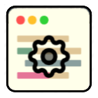
            </a>
        

    </td>
    <td>
        <ul>
            <li>Light & dark versions!
            <li>Powered up ⚡ with custom JS 👨‍💻
            <li>Theme options for sizes, features on/off, backgrounds and colors! (Settings -> Plugins)
            <li>Default "Fira Sans" + AiWriter Quattro, Inter & OS System fonts
            <li>Auto <b>favicons</b> for external links! <a href="#-auto-favicons-for-external-links">🡖</a>
            <li>Tabs plugin support, reposition & recolor - now like in real browser <a href="#-tabs-plugin">🡖</a>
            <li>Background image <a href="#-background-image">🡖</a>
            <li>Banners plugin support and powered-up! <a href="#-banners-plugin">🡖</a>
            <li>Changed default UI icons, new added
            <li>Custom main toolbar: nav arrows on left side, hidden home, redesigned search <a href="#-search-panel">🡖</a>
            <li>Sticky headers <a href="#-sticky-1st-level-bullets">🡖</a>
            <li>Colored tasks statuses & priorities
            <li>Redesigned admonition blocks <a href="#-redesigned-admonition-blocks">🡖</a>
            <li>Compact QUERY results header: settings, table toggler <a href="#-compact-query-results-header">🡖</a>
            <li>Bullet Threading plugin support
            <li>Custom styled `#quote` <a href="#-blockquotes">🡖</a>
            <li>`#.kanban` & `#.grid` columns (no plugin needed) <a href="#-kanban-board">🡖</a>
            <li>etc...
        </ui>
    </td>
 </tr>
</table>

## If you ❤ what i'm doing - you can support my work! ☕

## Screenshots

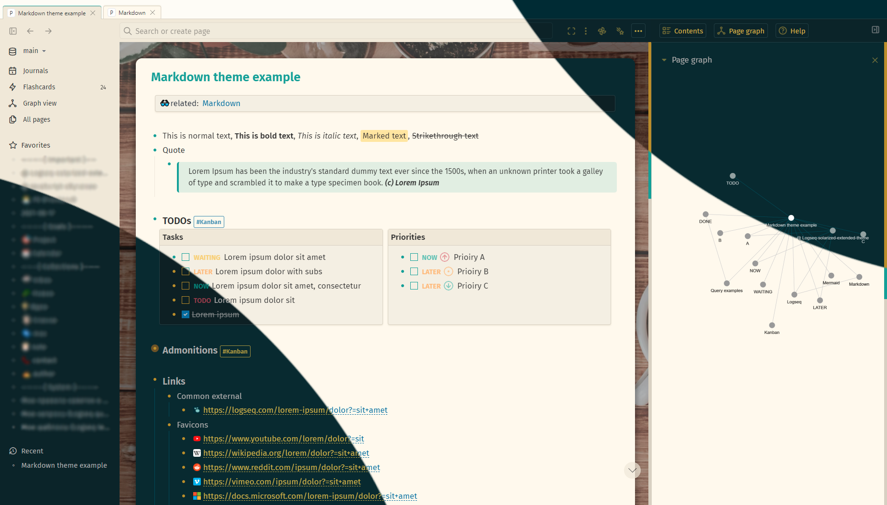

More here - https://github.com/yoyurec/logseq-solarized-extended-theme/tree/main/screenshots

## Installation
This theme is available on the Marketplace.

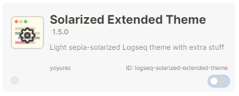

## Recommended plugins
* [Banners plugin](https://github.com/sawhney17/logseq-banners-plugin)
* [Tabs](https://github.com/pengx17/logseq-plugin-tabs)
* [Bullet Threading](https://github.com/pengx17/logseq-plugin-bullet-threading)
* [TOC Generator](https://github.com/sethyuan/logseq-plugin-tocgen)
* [TODO Master](https://github.com/pengx17/logseq-plugin-todo-master)

## Settings

### 🎨 Colors palette:
Change main colors in Settings

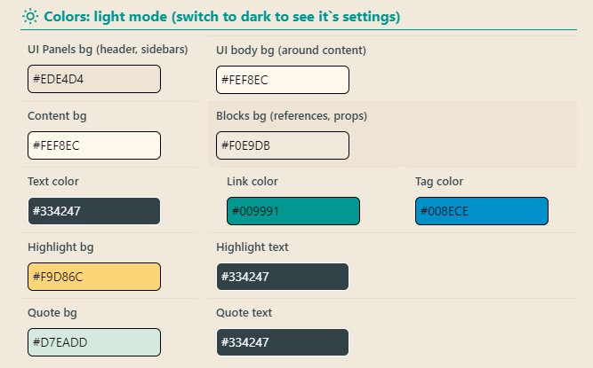

https://user-images.githubusercontent.com/137919/187081296-1c9c3312-cd86-4fbb-b78c-9fccbb0f52a5.mp4

### 🔮 Presets:
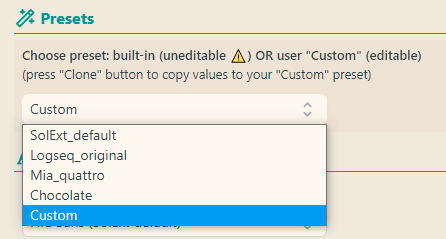

**Choose preset: built-in (uneditable ⚠) OR user "Custom" (editable)**

https://user-images.githubusercontent.com/137919/187081307-f4cd176f-c294-492e-9dc6-63d31b4cc50e.mp4

**Clone presets to edit it**

https://user-images.githubusercontent.com/137919/187081312-82125847-db92-4c64-b50c-51d2053baa5d.mp4

### 🈶 Fonts
Change font and text size

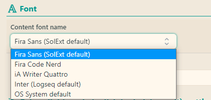

### 📏 Sizes
Change sidebars and content width in Settings

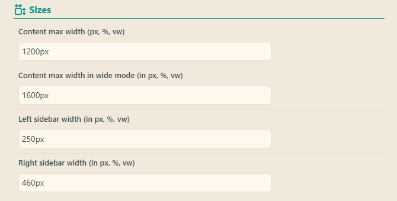

## Features and customizations
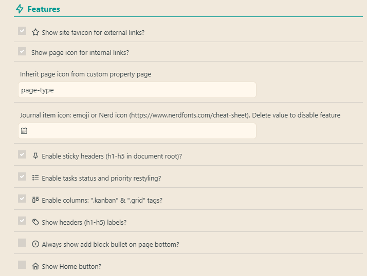

### 🖼 Background image:
* go to https://unsplash.com
* choose any image, click (go to its details page with bigger image)
* right click on image, "copy image link",
* edit URL in settings

### 📰 Banners plugin
Theme supports [Banners plugin](https://github.com/pengx17/logseq-plugin-tabs)
Background = blurred banner!
Icon glows!

Demo video: https://www.loom.com/share/31416785f6764a7a80fba271aea4ea79

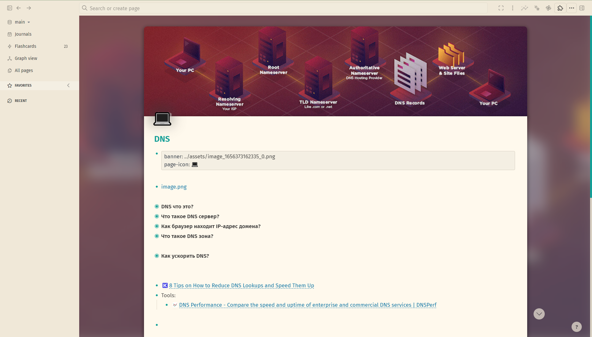

### ⭐ Auto favicons for external links

### 📌 Sticky headers (h1-h5 in document root):

### 🔍 Search panel

### 🗂 Tabs plugin
Theme supports [Tabs plugin](https://github.com/pengx17/logseq-plugin-tabs) - panel was moved to top & recolored
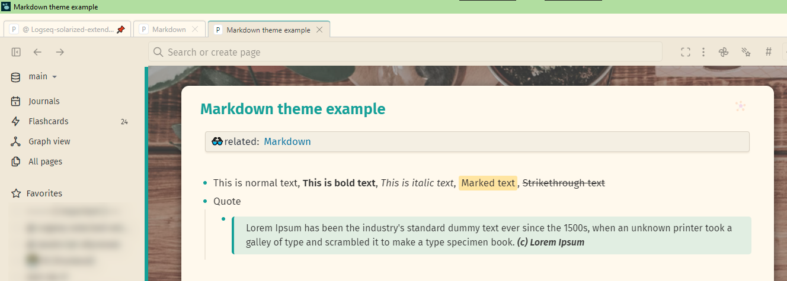

### 💬 Blockquotes
Just add `#quote` tag to parent block!

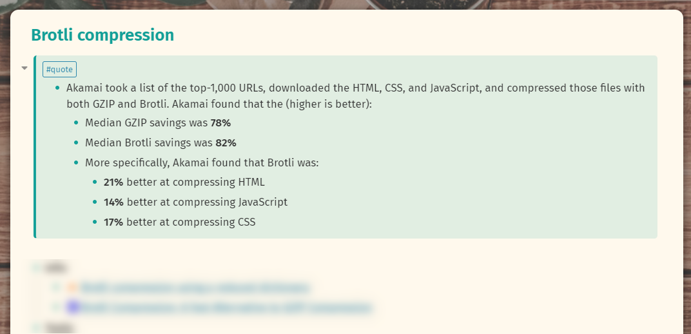

### 🚥 Kanban board
Just add `#.kanban` tag to parent block and all children will become columns!
Recommend additionally to install [Logseq Plugin TODO Master](https://github.com/pengx17/logseq-plugin-todo-master)
and check [Logseq template](./extra/Kanban%20template.md)
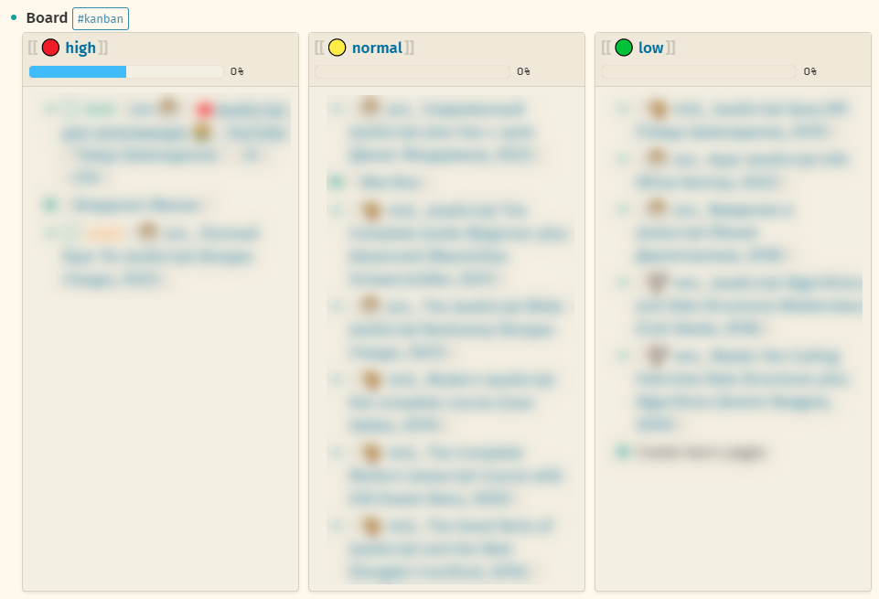

### 📋 Compact QUERY results header
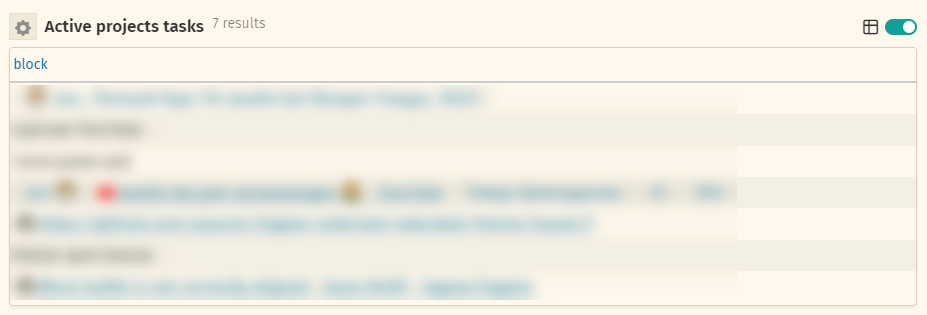

### 📝 Redesigned admonition blocks
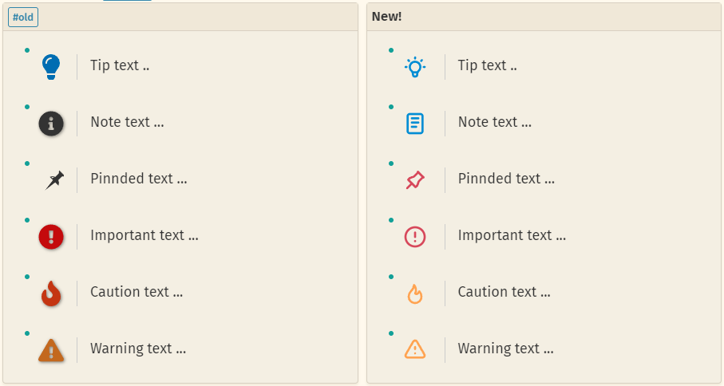

## What is Logseq?
Logseq is a privacy-first, open-source knowledge base. Visit https://logseq.com for more information.

## Support
* Read about Logseq plugin updates on Dicscord - https://discord.com/channels/725182569297215569/896368413243494430
* Ask about Logseq plugins on Dicscord - https://discord.com/channels/725182569297215569/752845167030960141
* If you have any questions, issues or feature request, use the issue submission on GitHub: https://github.com/yoyurec/logseq-solarized-extended-theme/issues

## Credits
* Icon - Keiran O'Leary https://dribbble.com/shots/6361500-Alacritty-Terminal-Icon
* ["iA Writer" fonts](https://ia.net/topics/a-typographic-christmas): Copyright © 2018 Information Architects Inc. with Reserved Font Name "iA Writer". Licensed under the SIL Open Font License 1.1.
* Theme colors inspiration - Nicholas Martin https://github.com/nmartin84/logseq-solarized
* Tasks status colors - @Danzu https://discord.com/channels/725182569297215569/725182570131751005/952564162792402976
* Kanban view inspiration - @Cannibalox https://github.com/cannibalox/logtools
* Calculator colors - @Playerofgames https://github.com/playerofgames/logseq-mia-theme

## License

[MIT License](./LICENSE)
